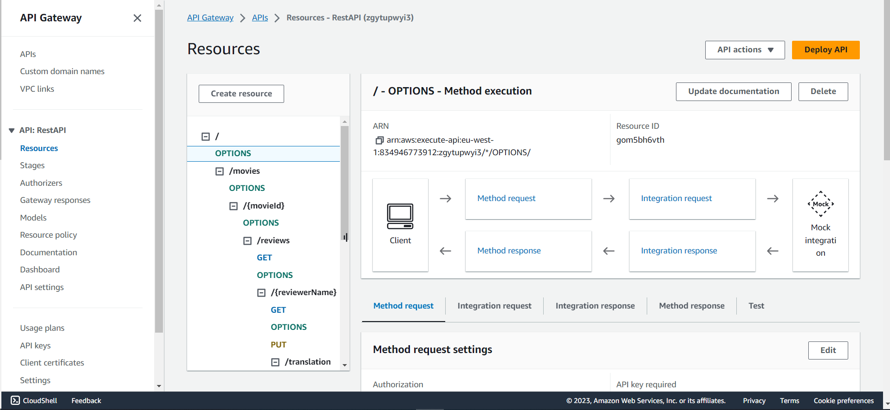
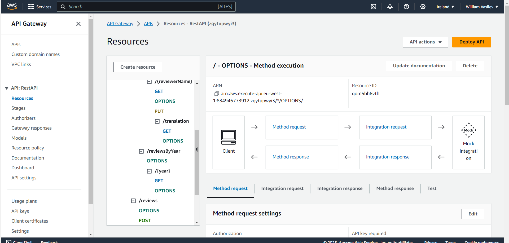
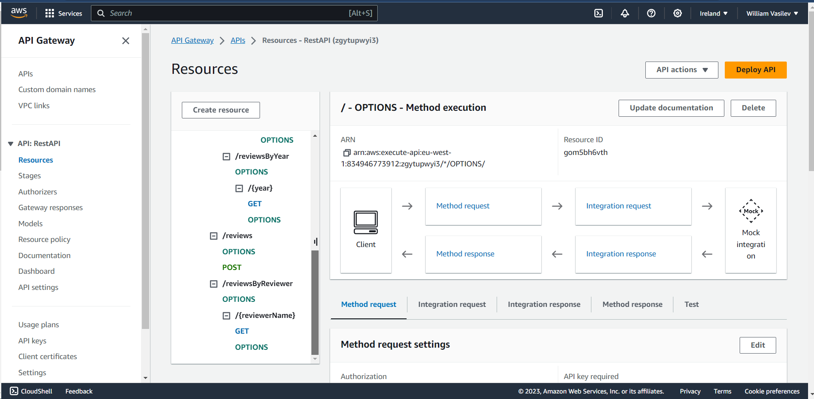
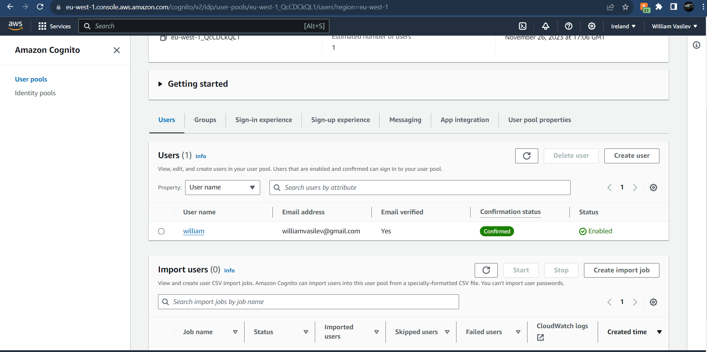

## ServerlessREST Sddignment - Distributed Systems.

__Name:__ William Vasilev

This repository contains the implementation of a serverless REST API for the AWS platform. A CDK stack creates the infrastructure. The domain context of the API is movie reviews.

### API endpoints.

+ POST /movies/reviews - add a movie review.
+ GET /movies/{movieId}/reviews - Get all the reviews for a movie with the specified id.
+ GET /movies/{movieId}/reviews?minRating=n - Get all the reviews for the movie with the specified ID with a rating greater than the minRating.
+ GET /movies/{movieId}/reviews/{reviewerName} - Get the review for the movie with the specified movie ID and written by the named reviewer.
+ PUT /movies/{movieId}/reviews/{reviewerName} - Update the text of a review. (movie ID and reviewer username uniquely identify a review item)
+ GET /movies/{movieId}/reviews/{year} - Get the review(s) for the movie with the specified movie ID and were written in a specified year.
+ GET /movies/reviews/{reviewerName} - Get all the reviews written by a specific reviewer.
+ GET /movies/{movieId}/reviews/{reviewerName}/translation?language=code - Get a translated version of the review for the movie with the specified movie ID and written by the named reviewer.

[Include screenshots from the AWS console (API Gateway service) that clearly show the deployed API ( have legible font size). ]

### Authentication..

[Include a screenshot from the AWS console (Cognito User Pools) showing a confirmed user account.]

### Independent learning (If relevant).

[ Briefly explain any aspects of your submission that required independent research and learning, i.e. not covered in the lectures/labs. State the files that have evidence of this.

I used the aws doc and video provided in the CA1 spec for translation
https://completecoding.io/typescript-translation-api/
https://docs.aws.amazon.com/translate/latest/dg/what-is.html
The file i used translation is in lambdas/translate.ts and lib/rest-api-stack.ts

State any other evidence of independent learning achieved while completing this assignment.

I used DynamoDB's BEGINS_WITH function to extract the year from the reviewDate type to get the reviews from a year.
https://docs.aws.amazon.com/amazondynamodb/latest/developerguide/ql-functions.beginswith.html
The file i use BEGINS_WITH is in lambdas/getMovieReviewsByYear.ts
